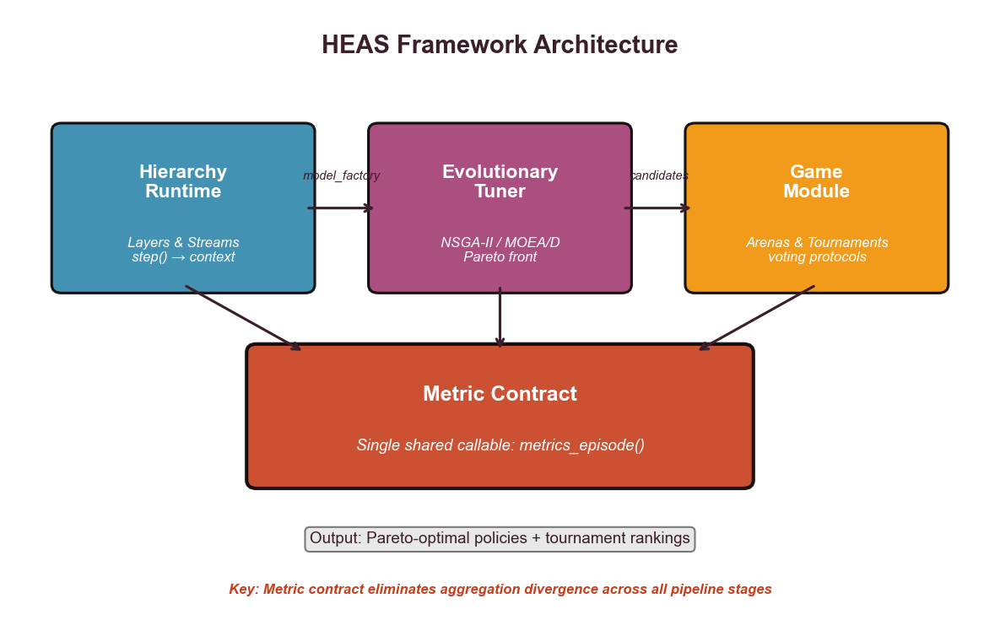
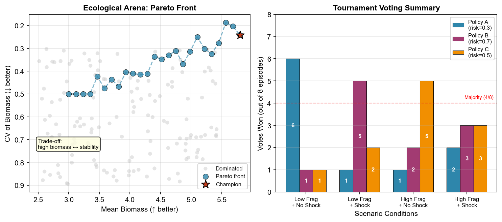

# Summary

HEAS is a Python framework that connects agent-based simulation, evolutionary
search, and scenario-based evaluation in a single reproducible pipeline. It
is designed for researchers who study systems where local interactions produce
system-level outcomes---ecosystems, organizations, markets, or regulatory
environments---and who need to search over candidate strategies and compare
them across uncertain scenarios. HEAS combines three modules: a hierarchy
runtime for composing simulations from reusable process layers, an
evolutionary tuner for single- or multi-objective search backed by DEAP, and
a game module for evaluating strategies across scenario ensembles. Its central
design principle is the *metric contract*: the same outcome function is shared
by optimization, evaluation, and validation, so that different parts of an
analysis cannot silently rank strategies by different quantities.

# Statement of Need

Many research problems now require simulation plus search. Ecologists compare
management rules under uncertain shocks; social scientists test institutional
designs in heterogeneous populations; engineers tune systems with competing
performance and robustness objectives. Agent-based and individual-based models
are now used across disciplines to represent complex systems made up of
autonomous entities [@grimm2006odd]. These studies often need the same
sequence of steps: build a model, run a search algorithm, evaluate candidate
solutions across scenarios, and validate the final ranking.

Several mature tools cover parts of this workflow. Mesa [@mesa3_2025] and
NetLogo [@wilensky1999] provide strong foundations for building and exploring
agent-based models, but leave multi-objective search and scenario comparison
to project-specific scripts. AgentPy [@agentpy2021] adds parameter sweeps
and Monte Carlo experiments in Python, but does not connect these to
evolutionary optimization or tournament evaluation. DEAP [@deap2012] offers a
flexible evolutionary computation toolkit, but requires the user to wire up
simulation coupling, metric definitions, and scenario handling manually.
EMA Workbench [@kwakkel2017] focuses on exploratory modeling and robust
decision making under deep uncertainty, emphasizing many-model experiments
rather than multi-objective search over a single simulation hierarchy.
OpenMOLE [@reuillon2013openmole] provides workflow-based model exploration with
high-performance computing support, targeting large-scale parameter space
exploration rather than integrated simulation-optimization with shared
metric definitions.

In each case, the connection between simulation, search, and evaluation is
left to the user. A common pattern is to couple an agent-based model to
NSGA-II [@deb2002], then re-score the resulting strategies in held-out
scenarios. The optimizer, tournament evaluator, and validation code must
compute the same outcome, yet this consistency is rarely enforced by the
framework. Small differences in aggregation can change which strategy appears
best without raising an error. HEAS is designed for researchers who need this
end-to-end pipeline to be explicit, reproducible, and reusable across
substantive domains.

# State of the Field

Several frameworks address overlapping parts of the simulation-optimization
pipeline. @table:comparison summarizes how HEAS positions itself relative to
existing tools.

| Capability | Mesa | NetLogo | AgentPy | DEAP | EMA Workbench | OpenMOLE | **HEAS** |
|---|---|---|---|---|---|---|---|
| Agent-based modeling | $\checkmark$ | $\checkmark$ | $\checkmark$ | — | — | — | $\checkmark$ |
| Multi-objective search | — | — | — | $\checkmark$ | — | — | $\checkmark$ |
| Scenario analysis | — | — | — | — | $\checkmark$ | — | $\checkmark$ |
| Shared metric across pipeline | — | — | — | — | — | — | $\checkmark$ |
| Hierarchical composition | — | — | — | — | — | — | $\checkmark$ |
| Parallel / HPC | — | — | — | — | — | $\checkmark$ | partial |
| Python-native | $\checkmark$ | — | $\checkmark$ | $\checkmark$ | $\checkmark$ | — | $\checkmark$ |

*Table 1: Capability comparison across simulation-optimization frameworks.
"Supports" ($\checkmark$) indicates the framework provides built-in primitives for that
capability; "—" indicates no native support; "partial" indicates limited or
experimental support. OpenMOLE orchestrates external ABM models (e.g. from
NetLogo) but does not provide native agent classes or scheduling primitives.
EMA Workbench supports exploratory scenario analysis and scenario discovery,
but uses many-model ensembles rather than voting-rule-based tournaments.
"Shared metric across pipeline" means the same outcome function is enforced
by the framework across optimization, evaluation, and validation. "Hierarchical
composition" means simulations can be assembled from layered, reusable process
components.*

Mesa [@mesa3_2025] and NetLogo [@wilensky1999] are strong choices for building
and exploring agent-based models, but they do not provide integrated
multi-objective search or scenario-based evaluation. AgentPy
[@agentpy2021] adds parameter sweeps and Monte Carlo experiments, but does
not connect these to evolutionary optimization. DEAP [@deap2012] provides
modular evolutionary algorithms; HEAS builds on DEAP rather than replacing it.
EMA Workbench [@kwakkel2017] supports exploratory modeling and robust decision
making under deep uncertainty, but frames the workflow around many-model
ensembles rather than multi-objective search within a single simulation
hierarchy. OpenMOLE [@reuillon2013openmole] orchestrates model exploration across
high-performance computing resources, but does not enforce metric consistency
across the optimization and evaluation stages.

HEAS contributes the missing integration layer: it connects hierarchical
simulation, multi-objective search, scenario comparison, and a shared outcome
definition in one framework. This makes HEAS useful to modelers who already
know how to write a simulation, but need a more reliable bridge from
simulation to search and comparative evaluation.

# Software Design

HEAS has three modules that share a common data flow.

**Hierarchy runtime.** A *stream* is a user-defined process that reads from
and writes to a shared simulation context. Streams are the basic units of
composition: each one encapsulates a piece of domain logic (an ecological
process, a firm, a regulator, or an ODE system) while remaining agnostic
about how other streams behave. A *layer* groups streams that execute at the
same temporal resolution. A *hierarchy* orders layers so that slower processes
(e.g.\ seasonal dynamics) frame faster ones (e.g.\ daily agent decisions).
The following example defines a stream and registers it in a two-layer
hierarchy:

```python
from heas.hierarchy.base import Stream, Context
from heas.hierarchy.orchestrator import (
    LayerSpec, StreamSpec, make_model_from_spec,
)

class Prey(Stream):
    def __init__(self, name, ctx, growth=0.05, **kw):
        super().__init__(name, ctx)
        self.growth = growth
        self.pop = 100.0

    def step(self):
        self.pop *= 1 + self.growth
        self.ctx.data["prey"] = self.pop

class Predator(Stream):
    def __init__(self, name, ctx, conversion=0.02, **kw):
        super().__init__(name, ctx)
        self.conversion = conversion

    def step(self):
        prey = self.ctx.data.get("prey", 0)
        self.ctx.data["predators"] = prey * self.conversion

spec = [
    LayerSpec(streams=[StreamSpec("prey", Prey, {"growth": 0.05})]),
    LayerSpec(streams=[StreamSpec("pred", Predator, {"conversion": 0.02})]),
]
model_factory = make_model_from_spec(spec, seed=42)
```

The hierarchy runtime executes layers in order and passes the shared context
downstream, so the same stream can be reused in different hierarchies without
modification.

**Evolutionary tuner.** The tuner connects DEAP-backed single- and
multi-objective search (NSGA-II [@deb2002], MOEA/D [@zhang2007moead]) to the hierarchy. A *gene schema*
maps candidate parameter vectors to stream parameters, and a single
`metrics_episode()` callable evaluates each episode. Deterministic seeding
and parallel episode execution ensure reproducibility.

**Game module.** The game module evaluates candidate strategies across
scenario ensembles and aggregates results using configurable voting rules
(argmax, majority, Borda count, Copeland pairwise majority). It receives the
same `metrics_episode()` used by the tuner, so rankings are guaranteed to be
computed from the same outcome definition.

The main design trade-off is that HEAS keeps domain behavior in user-defined
streams rather than imposing a single scientific model type. This is less
prescriptive than a domain-specific simulator, but it lets the same workflow
serve ecology, organizational analysis, policy design, and mathematical
systems modeling. The metric contract is the corresponding constraint: users
define the outcome once, and the same definition is passed through search,
tournament evaluation, and validation.

{#fig:architecture}

*Figure 1: HEAS three-module architecture. The Hierarchy Runtime composes simulations from layers and streams, the Evolutionary Tuner performs multi-objective search (NSGA-II/MOEA/D), and the Game Module evaluates policies across scenario ensembles. The Metric Contract ensures all three modules compute the same outcome metric through a single shared callable, eliminating aggregation divergence.*

# Use Cases

HEAS has been applied to three reference studies that exercise different
scientific logics while keeping the framework pipeline fixed. In each case,
only the stream factories, gene schemas, scenarios, and episode metrics
change; the hierarchy, search, tournament, and metric-contract interfaces
remain the same. These studies demonstrate that the same framework surface
supports both evolutionary search and held-out scenario evaluation without
rewiring, which is the main portability claim of the software. The
enterprise regulatory design case is currently documented in the literature
[@zhang2026metricaggregationdivergencehidden], while the ecological and
Wolf-Sheep configurations serve as reference demonstrations of the same
framework interface across different model families.

**Ecological population management** assembles a predator-prey arena with
five streams, a 2-gene policy (`risk`, `dispersal`), and
fragmentation $\times$ shock scenarios. The same model-construction and
evaluation surface supported both evolutionary search and a held-out
64-scenario robustness check without modification.

**Enterprise regulatory design** reuses the same framework contracts for a
four-layer regulatory arena with a 4-gene policy
(`tax_rate`, `audit_intensity`, `subsidy`, `penalty_rate`). The tuner ran
NSGA-II over a larger scenario ensemble. The domain logic changes
substantially, but the search and tournament wiring do not.

**Wolf-Sheep ODE** keeps the framework interfaces fixed while swapping the
underlying model family from an agent simulation to a mean-field
Lotka-Volterra system. This case is the clearest portability test: the
4-layer arena required no framework-side coupling beyond a new
`metrics_episode()` implementation.

{#fig:pareto}

*Figure 2: Example outputs from the ecological arena case study. Left: Pareto front showing the trade-off between mean biomass (higher is better) and coefficient of variation (lower is better). The star marks the champion policy selected by HEAS. Right: Tournament voting summary showing how different policies perform across scenario conditions, with majority threshold indicated.*

# Availability and Reproducibility

HEAS includes a command-line interface for batch runs and a browser-based
playground at <https://ryzhanghason.github.io/heas/> for configuring
simulations, inspecting Pareto fronts, and exporting publication bundles
without a backend server. The repository includes a `CONTRIBUTING.md` guide,
a `CODE_OF_CONDUCT.md`, release metadata, automated tests, and a versioned
Zenodo archive [@heasarchive2026].

# Research Impact Statement

HEAS has already supported policy analysis, including policy diffusion
settings, and organizational strategy optimization. Its research value is to
make these workflows reproducible within one framework by keeping simulation,
search, and scenario evaluation aligned through a shared metric contract. In
these settings, HEAS has been useful for comparing candidate strategies
across heterogeneous scenarios while preserving one explicit outcome
definition from optimization through final evaluation
[@zhang2026metricaggregationdivergencehidden].

# Acknowledgements

The authors acknowledge the open-source simulation and optimization
communities whose tools and documentation informed HEAS, especially Mesa,
NetLogo, AgentPy, DEAP, EMA Workbench, and OpenMOLE.

# AI Usage Disclosure

The authors used AI-assisted tools in limited support roles. The authors take
full responsibility for all submitted work.

# References
